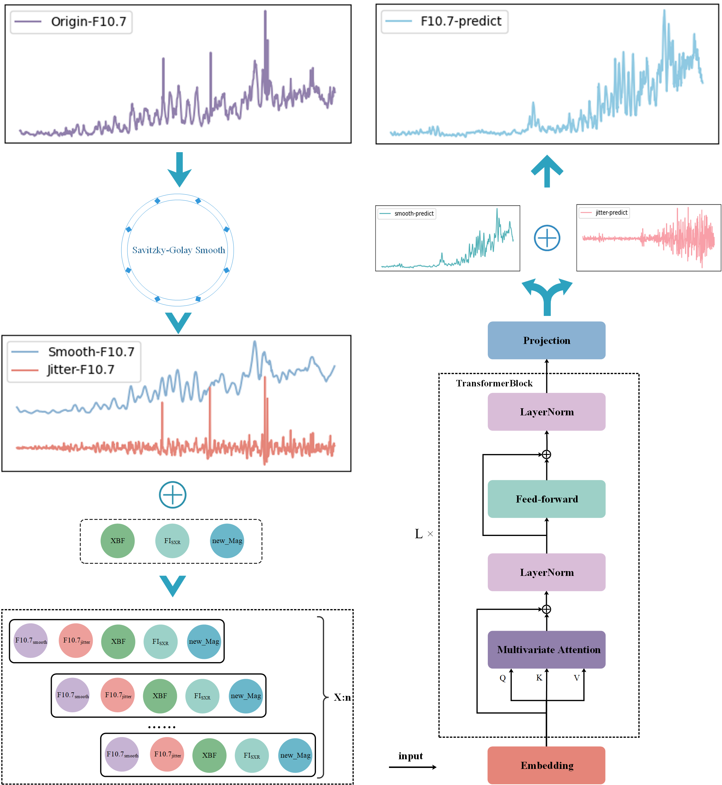

# Research on F10.7 Index Prediction Based on Factor Decomposition and Feature Enhancement

This repository contains the code and data for the research presented in the paper "Research on F10.7 Index Prediction Based on Factor Decomposition and Feature Enhancement." The project focuses on the analysis and prediction of the F10.7 solar radio flux, utilizing factor decomposition techniques and feature enhancement strategies to improve predictive accuracy.

## Project Structure

### 1. Dataset
The `Dataset` folder includes the essential data used in this project:

- **Origin_multi_data.csv**: This file contains the original F10.7 time series data along with other relevant features, which have not been subjected to any decomposition or filtering processes.
- **SG_all_data.csv**: This file provides the F10.7 time series after Savitzky-Golay (SG) filtering, including both the smoothed sequence and jitter sequence, along with additional features.

### 2. SG_jitter and SG_smooth
These two folders contain the primary experimental content and scripts:

- **SG_jitter**: Contains scripts focused on analyzing and modeling the jitter sequence extracted from the F10.7 data.
- **SG_smooth**: Contains scripts dedicated to analyzing and modeling the smoothed F10.7 sequence.

#### Models, Utils, Layers
These folders contain the core components for building and training the models:

- **models**: Contains the model architectures used for F10.7 prediction.
- **utils**: Utility functions used throughout the project for data processing, analysis, and evaluation.
- **layers**: Custom layers and modules designed to enhance the models' predictive capabilities.

#### Main Program and Configuration

- **exp folder**: Houses the main scripts that drive the experiments, coordinating the data flow and model interactions.
- **run.py**: The central script for configuring, training, and testing the models. This script allows for flexible experimentation by adjusting parameters and settings directly within the configuration.
- 
#### Schematic of the proposed F10.7 prediction strategy
The model structure of the new prediction strategy proposed in this paper is as follows:

### 3. Institution_data
The `institution_data` folder stores prediction data provided by various reputable institutions:

- **SWPC**: Data from the Space Weather Prediction Center.
- **British Geological Survey (BGS)**: Data from the British Geological Survey.
- **Collecte Localisation Satellites (CLS)**: Data from the CLS.

## Getting Started

### Prerequisites
To run this project, you'll need the following dependencies:

- Python 3.8
- Required Python libraries (listed in `requirements.txt`)

  
## Acknowledgements
We gratefully acknowledge the Dominion Radio Astrophysical Observatory (Penticton, Canada) for providing the F10.7 indices, as well as the National Oceanic and Atmospheric Administration and the Space Weather Prediction Center for their contributions to the dataset. We also acknowledge the support of the Strategic Priority Research Program of the Chinese Academy of Sciences (No. XDB0560000).
